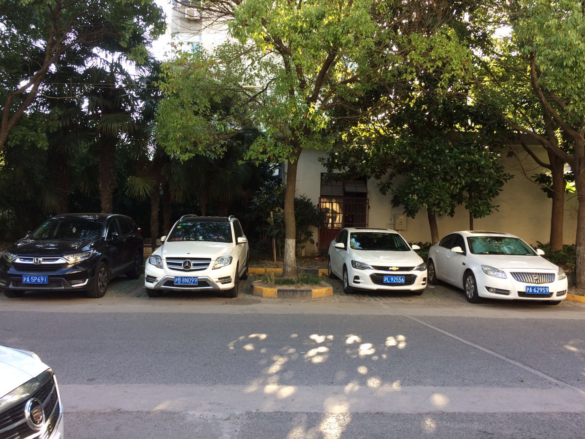
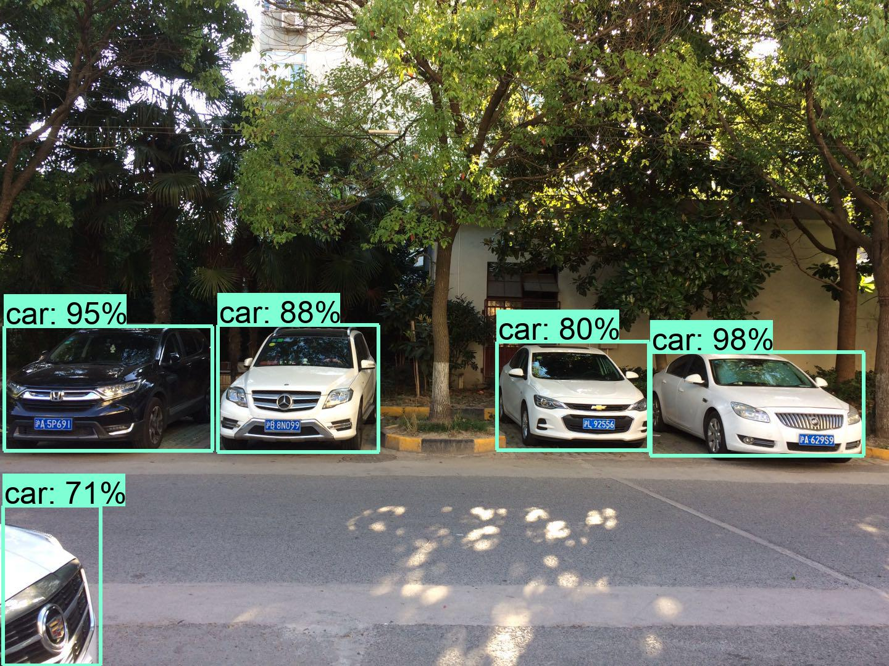
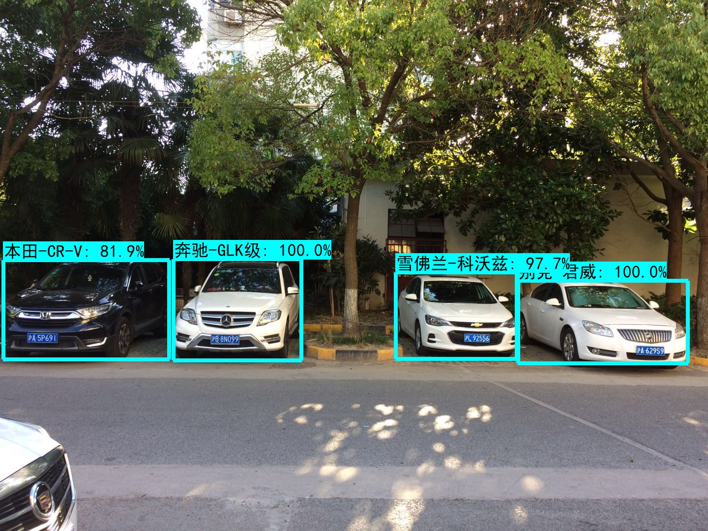

# 车辆检测及型号识别
#### 车辆检测及型号识别被广泛应用于物业、交通等的管理场景中。通过在停车场出入口、路口、高速卡口等位值采集的图片数据，对车辆的数量及型号进行识别，可以高效的对车辆信息进行采集。通过采集的数据，在不同的场景中可以辅助不同的业务开展。如商场停车位的规划、路况规划，或者公安系统追踪肇事车辆等，适用于智能交通、自动驾驶、安防等领域，应用前景广阔。本项目采用 “检测 + 分类”并行的方式检测出图片中不同车辆的位置、并识别出每辆车的型号。

## 1 &nbsp;检测方法
##### 1）使用SSD目标检测预训练模型检测图片中的车辆，得到车辆的边框位置。
##### 2）根据车辆边框位置，把检测到的车辆裁切成单独的图片，用Inception V4分类模型对车辆型号进行分类，得到车辆型号类别和分类准确度。
##### 3）在原图检测到的车辆的边框位置处，标注车辆型号和分类准确度，完成对图片中车辆位置的检测和型号的识别。

## 2 &nbsp;检测结果 
##### 1) 加载检测模型的图协议文件，检测图片中的车辆。
    detection_graph = tf.Graph()
    with detection_graph.as_default():
        od_graph_def = saved_model_pb2.SavedModel()
        with tf.gfile.GFile('ssd.pb', 'rb') as fid:
            serialized_graph = compat.as_bytes(fid.read())
            od_graph_def.ParseFromString(serialized_graph)
            tf.import_graph_def(od_graph_def.meta_graphs[0].graph_def, name='')    
        with tf.Session(graph=detection_graph) as sess:
            image_tensor = detection_graph.get_tensor_by_name('image_tensor:0')        
            detection_boxes = detection_graph.get_tensor_by_name('detection_boxes:0')  
            detection_scores = detection_graph.get_tensor_by_name('detection_scores:0')   
            detection_classes = detection_graph.get_tensor_by_name('detection_classes:0') 
            num_detections = detection_graph.get_tensor_by_name('num_detections:0')
            image = Image.open(image_name)  
            img_width,img_height = image.size
            image_np = image_to_numpy(image)            
            image_np_expanded = np.expand_dims(image_np, axis=0)     
            (boxes, scores, classes, num) = sess.run([detection_boxes, detection_scores, detection_classes, num_detections],\
                                                      feed_dict={image_tensor: image_np_expanded})       
可视化检测结果，如下图所示：  
原图      
  
图片中检测到的车辆  

##### 2) 对检测到的所有车辆进行分类，得到车辆的型号和分类准确度。
    vehicle_name,vehicle_box = detection_box_accuracy(boxes, scores, classes)
    if vehicle_name and vehicle_box:
        classify_graph = tf.Graph()
        with classify_graph.as_default():        
            with open('inception_v4.pb', 'rb') as f:
                graph_def = tf.GraphDef()
                graph_def.ParseFromString(f.read())
                tf.import_graph_def(graph_def, name='')
            image_preprocessed_list = crop_box(vehicle_box, image,image_np)
            image_input_tensor = tf.stack(image_preprocessed_list)
            with tf.Session(graph=classify_graph) as sess:
                image_input = sess.run(image_input_tensor)
                softmax_tensor = sess.graph.get_tensor_by_name('InceptionV4/Logits/Predictions:0')
                predictions = sess.run(softmax_tensor, feed_dict={'input:0': image_input})
        vehicle_predict_name,vehicle_predict_box = classification_box_accuracy(predictions,vehicle_box)

##### 3) 在原图上画出检测到的车辆边框，并进行标注，标注内容为分类结果（车辆型号和分类准确率）。
    for i in range(len(vehicle_predict_box)):
        ymin = vehicle_predict_box[i][0]
        xmin = vehicle_predict_box[i][1]
        ymax = vehicle_predict_box[i][2]
        xmax = vehicle_predict_box[i][3]
        (left,right,top,bottom) = (xmin * img_width, xmax * img_width,ymin * img_height, ymax * img_height)
        draw.line([(left, top), (left, bottom), (right, bottom),(right, top),(left,top)], width=8,fill='cyan')

        font = ImageFont.load_default()
        text_width, text_height = font.getsize(vehicle_predict_name[i])  
        text_bottom = top
        margin = np.ceil(0.05 * text_height)
        draw.rectangle([(left, text_bottom - text_height - 2 * margin), (left + text_width,text_bottom)],fill='cyan')
        draw.text( (left + margin, text_bottom - text_height - margin), vehicle_predict_name[i],fill='black',font=font)
    img = np.array(image)
    plt.imshow(img)
被检测到的车辆及其型号：       
  